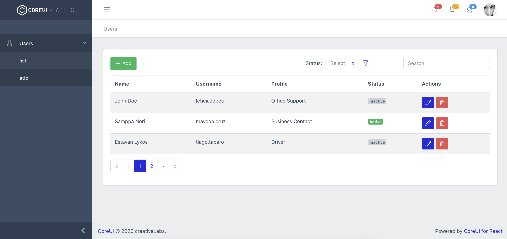

# Teste ReactJS da CiaTécnica

Simular um CRUD de usuário utilizando algum template
[Core Ui](https://coreui.io).

Utilizei o [react admin template](https://github.com/coreui/coreui-free-react-admin-template).

# Instalação

1. git clone https://github.com/lucianolopezz/teste-ciatecnica.git
2. cd `teste-ciatecnica`
3. Execute o comando **npm run start** ou **yarn start**.
